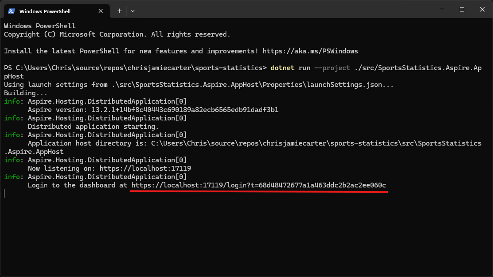
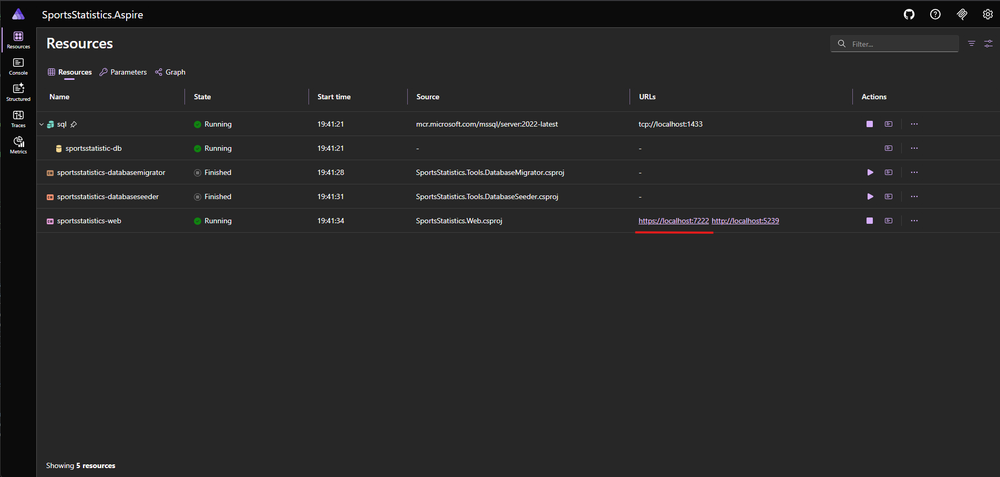
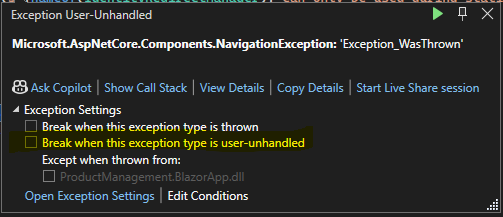
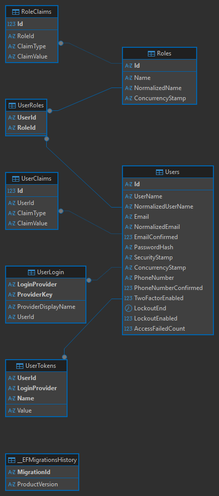
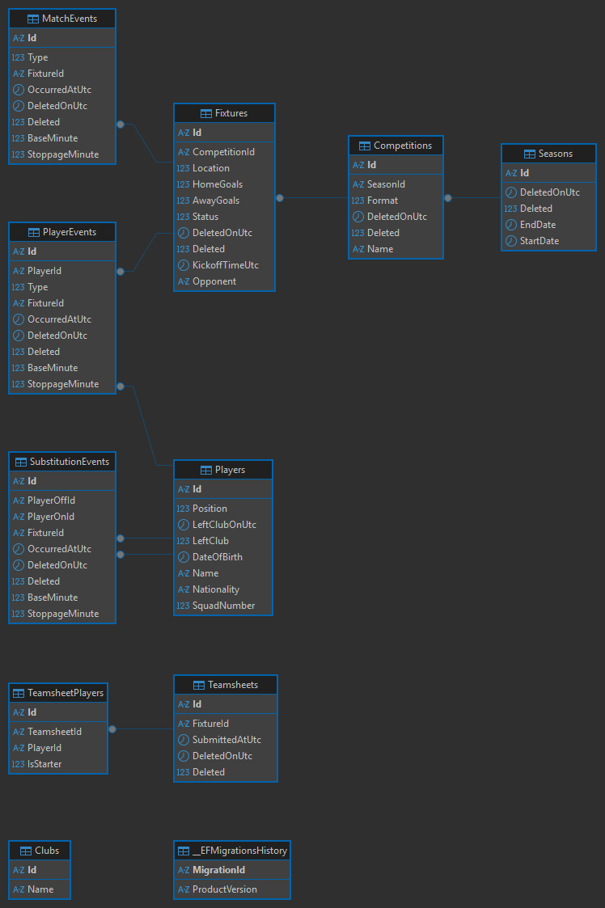

<div align="center">
    
    <h1>Sports Statistics</h1>
</div>

Welcome to the **Sports Statistics** App!

This is a .NET project designed to demonstrate building a complete full-stack web application with authentication, complex relational data modelling, domain-driven design, and modern UI design.

Sports Statistics is a comprehensive sports club management application that tracks team performance, manages player information, records match events, and generates insightful reports for coaches.

The web front end is delivered by a Blazor Server application and utilises Microsoft Fluent UI Blazor components for a professional enterprise look.
There is an integrated SQL Server database in the back end with Entity Framework Core for data access.

## Table of Contents <!-- omit in toc -->

- [Getting Started](#getting-started)
  - [Prerequisites](#prerequisites)
  - [Running the Application](#running-the-application)
  - [Database Migration](#database-migration)
  - [Database Seeding](#database-seeding)
- [Requirements](#requirements)
- [Challenges](#challenges)
- [Features](#features)
- [Technologies](#technologies)
- [Project Architecture](#project-architecture)
  - [Layer Structure](#layer-structure)
  - [Data Model](#data-model)
- [Usage](#usage)
  - [Dashboard](#dashboard)
  - [Match Tracking](#match-tracking)
  - [Reports](#reports)
  - [Administration](#administration)
- [Database Schema](#database-schema)
  - [identity](#identity)
  - [sports](#sports)
- [Version](#version)
- [Contributing](#contributing)
- [License](#license)
- [Contact](#contact)

## Getting Started

### Prerequisites

> [!IMPORTANT]
> These are required in order for the application to run.

- .NET 10 SDK.
- An IDE (code editor) like Visual Studio 2022 or Visual Studio Code.
- Docker (for SQL Server container).

### Running the Application

1. Ensure the Docker application is started.

2. Clone the repository:

   - `git clone https://github.com/chrisjamiecarter/sports-statistics.git`

3. You can run the AppHost project from Visual Studio (ensure **SportsStatistics.Aspire.AppHost** is set as the startup project).

OR

3. Run the AppHost application using the .NET CLI from the solution root directory:

   - `dotnet run --project ./src/SportsStatistics.Aspire.AppHost`

4. The application will start and open the Aspire dashboard on your default web browser.

> [!NOTE]
> If the Aspire dashboard does not open automatically, you can find the link from the cli.
>
> 

5. Wait for the Aspire resources to load. This may take some time on first use. Then click the sports-statistics-web https link to open the site.



6. Go to the Sign In page and use one of the demo accounts to get started!

> [!WARNING]
> For Development Testing Only.
>
> In Development mode, the Sign In page provides demo buttons for easy access:
> - **Administrator** - Full access including Admin area
> - **MatchTracker** - Access to match tracking
> - **ReportsViewer** - Read-only access to reports
>
> Alternatively, you can manually sign in with any of the seeded users:
> | Email | Password | Role |
> |-------|----------|------|
> | admin@sportsstatistics.com | Password123! | Administrator |
> | tracker@sportsstatistics.com | Password123! | MatchTracker |
> | reports@sportsstatistics.com | Password123! | ReportsViewer |
>
> The database seeder creates these users automatically. See [Database Seeding](#database-seeding) for details.

> [!NOTE]
> If you do not have a self-signed localhost certificate you will need to create one:
>
> `dotnet dev-certs https --trust`

> [!NOTE]
> If you run from Visual Studio, the application may catch a `Microsoft.AspNetCore.Components.NavigationException` exception.
> 
> Un-check `Break when this exception type is user-unhandled`
>
> 

### Database Migration

The application uses Entity Framework Core for database migrations. A dedicated DatabaseMigrator tool is provided to manage migrations.

When running via Aspire (the default method), migrations are applied automatically after the SQL Server container starts.

To apply migrations manually (if needed):

```bash
dotnet run --project ./src/SportsStatistics.Tools.DatabaseMigrator
```

This will apply all pending migrations to the SQL Server database.

### Database Seeding

A DatabaseSeeder tool is provided to populate the database with initial test data for development and testing purposes.

When running via Aspire (the default method), the seeder runs automatically after migrations complete, in the following sequence:

1. SQL Server container starts
2. DatabaseMigrator applies pending migrations
3. DatabaseSeeder populates test data
4. Web application starts

To seed the database manually (if needed):

```bash
dotnet run --project ./src/SportsStatistics.Tools.DatabaseSeeder
```

> [!NOTE]
> The seeder requires the database to exist and migrations to be applied first.

The seeder creates the following users with the specified roles:

| Email | Password | Role | Access |
|-------|----------|------|--------|
| admin@sportsstatistics.com | Password123! | Administrator | Full access including Admin area |
| tracker@sportsstatistics.com | Password123! | MatchTracker | Access to match tracking |
| reports@sportsstatistics.com | Password123! | ReportsViewer | Read-only access to reports |

The seeder also generates sample data including:
- Clubs, Players, Seasons, Competitions
- Fixtures with teamsheets
- Historical match events (goals, cards, substitutions)

## Requirements

This application fulfils the following [The C# Academy - Sports Statistics](https://thecsharpacademy.com/project/42/sports-statistics) project requirements:

- [x] This is an application that will track and generate reports about a sports team's performance.
- [x] The app has a page divided into two areas: The UI where the in-game data will be tracked and an area showing the current statistics.
- [x] The app has a reports area in a different page showing the players statistics across multiple games. Coaches can see detailed players information per game and per season. This area contains bar charts with the player's performance.
- [x] The UI contains a list of players with at least five parameters that will be tracked (Goals, Assists, Yellow Cards, Red Cards, Minutes Played).
- [x] Data is tracked with the click of a button.
- [x] The reports area is updated immediately upon a button being clicked.
- [x] Unit tests and integration tests covering critical and error-prone parts of the code base.
- [x] Authentication and Authorization so only logged in users can use the app.

## Challenges

This application fulfils these additional challenges:

- [x] Add an Admin area where players can be added.
- [x] Add role-based authorization with roles like: "view only", "admin", and "superuser".

## Features

- **Blazor Server**:
  - The web front end has been built with Blazor Server.
- **Microsoft Fluent UI**:
  - The web UI uses Microsoft Fluent UI Blazor components for a professional enterprise look and feel.
- **Authentication & Authorization**:
  - Users can sign in to access the application.
  - Role-based authorization with roles: Administrator, MatchTracker, and ReportsViewer.
  - All data is scoped to the authenticated user for privacy.
- **Club Management**:
  - Update the clubs name to display within the application.
- **Player Management**:
  - Comprehensive player profiles with squad numbers, positions, nationalities, and dates of birth.
  - Track player club status (Active, Left Club).
- **Season Management**:
  - Define seasons with date ranges to organize competitions and fixtures.
- **Competition Management**:
  - Support for different competition formats (League, Cup).
- **Fixture/Match Tracking**:
  - Schedule and manage matches against opponents.
  - Track match locations (Home, Away, Neutral).
  - Record match outcomes and scores.
  - Track match status (Scheduled, In Progress, Completed).
- **Teamsheet Management**:
  - Create and manage team selections for each fixture.
  - Track starting XI and substitutes.
- **Live Match Tracking**:
  - Real-time tracking of match events including Goals, Assists, Yellow Cards, Red Cards.
  - Substitution tracking with minute markers.
  - Match clock and period tracking (First Half, Half Time, Second Half, Full Time).
- **Reports & Analytics**:
  - **Top Scorers**: Displays the top goal scorers by season with bar charts.
  - **Top Assists**: Displays the top assists by season with bar charts.
  - Player statistics across multiple games and seasons.
- **Entity Framework Core**:
  - Entity Framework Core is used as the ORM with code-first migrations.
- **SQL Server**:
  - SQL Server is used as the data provider.
- **.NET Aspire**:
  - The application uses .NET Aspire for simplified cloud-native development and orchestration.
- **CQRS with MediatR**:
  - Command Query Responsibility Segregation pattern for clean separation of read and write operations.
- **Domain-Driven Design**:
  - Rich domain models with value objects, domain events, and entity base classes.
  - Result pattern for explicit error handling.
- **Responsive Web Design**:
  - A user-friendly web interface has been designed to work on various devices.

## Technologies

- .NET 10 SDK
- ASP.NET Core
- Blazor Server
- Microsoft Fluent UI Blazor
- Entity Framework Core
- Microsoft Identity
- SQL Server
- .NET Aspire
- MediatR (CQRS)
- FluentValidation

## Project Architecture

This project implements **Clean Architecture** pattern to organize the application into distinct layers with clear separation of concerns, following Domain-Driven Design principles.

### Layer Structure

- **SportsStatistics.Aspire.AppHost**: The Aspire App Host project that orchestrates the application services and database.

- **SportsStatistics.Web**: The web front-end project built with Blazor Server. This project handles the UI layer and user interactions.

- **SportsStatistics.Domain**: The innermost layer containing:
  - **Entities**: Domain models (Player, Club, Season, Competition, Fixture, Teamsheet, MatchEvents)
  - **Value Objects**: Immutable types (Name, DateRange, SquadNumber, Position, Score)
  - **Domain Events**: Events raised by entities (PlayerCreatedDomainEvent, FixtureCreatedDomainEvent, etc.)
  - **Enums**: Value types (PlayerEventType, MatchEventType, FixtureStatus, MatchPeriod)

- **SportsStatistics.Application**: The core business logic layer containing:
  - **CQRS Commands**: Create, Update, Delete operations
  - **CQRS Queries**: Read operations with filtering and sorting
  - **Validators**: FluentValidation validators for commands
  - **DTOs**: Data transfer objects for API communication
  - **Interfaces**: Abstractions for database context and messaging

- **SportsStatistics.Infrastructure**: The infrastructure layer containing:
  - **Entity Configurations**: EF Core configurations for entities
  - **Database Migrations**: Code-first migrations
  - **Converters**: Value object converters for EF Core
  - **Domain Events Dispatcher**: Infrastructure for dispatching domain events

- **SportsStatistics.Authorization**: Cross-cutting concern for authentication and authorization using Microsoft Identity.

- **SportsStatistics.SharedKernel**: Shared resources and common utilities used across projects:
  - **Result Pattern**: Result<T> and Error types for explicit error handling
  - **Entity Base Class**: Base class for all entities with domain event support
  - **Interfaces**: ISoftDeletableEntity, IDomainEvent, IDateTimeProvider

- **SportsStatistics.Tools.DatabaseMigrator**: A dedicated project for managing database migrations.

- **SportsStatistics.Tools.DatabaseSeeder**: A dedicated project for seeding the database with test data.

- **SportsStatistics.Aspire.ServiceDefaults**: Shared Aspire service defaults for consistent configuration.

- **SportsStatistics.Aspire.Constants**: Shared constants for Aspire configuration.

### Data Model

The application uses a complex relational data model with the following main entities:

- **Clubs**: Club name
- **Players**: Player profiles with personal information, positions, and club status
- **Seasons**: Seasonal periods with date ranges
- **Competitions**: Competition details with formats
- **Fixtures**: Match scheduling and results
- **Teamsheets**: Player lineups for each fixture
- **Match Events**: Goals, cards, and other in-game events
- **Player Events**: Individual player statistics during matches
- **Substitutions**: Player substitution tracking
- **ApplicationUser**: User identity data

## Usage

Please click the link below to watch a short YouTube video demonstration:

[](https://youtu.be/CoMfXYhVzGo "Sports Statistics Showcase")

### Dashboard

The Dashboard page provides an overview of your team statistics including:
- Current season information
- Recent match results
- Top players overview

### Match Tracking

The Match Tracker page allows real-time tracking of match events:
- Select a fixture to track
- Click buttons to record Goals, Assists, Yellow Cards, Red Cards
- Make substitutions with minute markers
- View live match clock and statistics

### Reports

The Reports page provides analytics for coaches:
- View Top Scorers by Season with bar charts
- View Top Assists by Season with bar charts
- Filter by season to see historical data

### Administration

The Admin area (requires Administrator role) allows management of:
- Club
- Players
- Seasons
- Competitions
- Fixtures

## Database Schema

The database contains the following main tables:

- **Clubs**: Stores club information
- **Players**: Stores player profiles with personal details
- **Seasons**: Stores season date ranges
- **Competitions**: Stores competition details
- **Fixtures**: Stores match scheduling and results
- **Teamsheets**: Stores player lineups for fixtures
- **TeamsheetPlayers**: Join table for teamsheet-player relationships
- **MatchEvents**: Stores in-game events (goals, cards)
- **PlayerEvents**: Stores individual player statistics during matches
- **Substitutions**: Stores substitution records
- **AspNetUsers**: User identity data
- **AspNetRoles**: Role definitions
- **AspNetUserRoles**: User-role assignments

### identity



### sports



## Version

This document applies to the SportsStatistics v1.0.0 release version.

## Contributing

Contributions are welcome! Please fork the repository and create a pull request with your changes. For major changes, please open an issue first to discuss what you would like to change.

## License

This project is licensed under the MIT License. See the [LICENSE](./LICENSE) file for details.

## Contact

For any questions or feedback, please open an issue.

---

**_Happy Sports Tracking!_**
